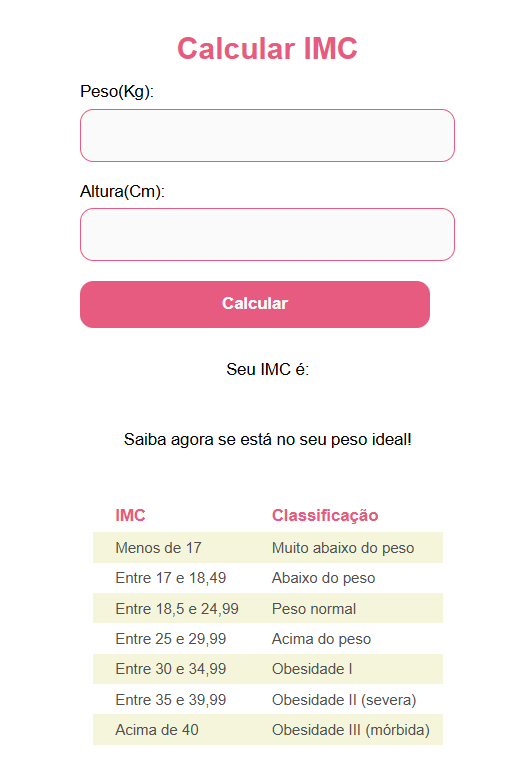

# Calculadora IMC

Uma aplicação web simples feita com **React** para calcular o IMC (Índice de Massa Corporal) e informar a classificação com base no resultado.

## Preview

---

## Tecnologias

- React.js
- Styled-components
- JavaScript (ES6+)
- React Router DOM

---

## Funcionalidades

- Entrada de **peso (kg)** e **altura (m)**
- Cálculo automático do IMC
- Redirecionamento para uma nova página com o resultado
- Tabela de classificação de acordo com o IMC
- Estilização com styled-components

---

## Como calcular o IMC

A fórmula usada é:

IMC = Peso / (altura * altura)

